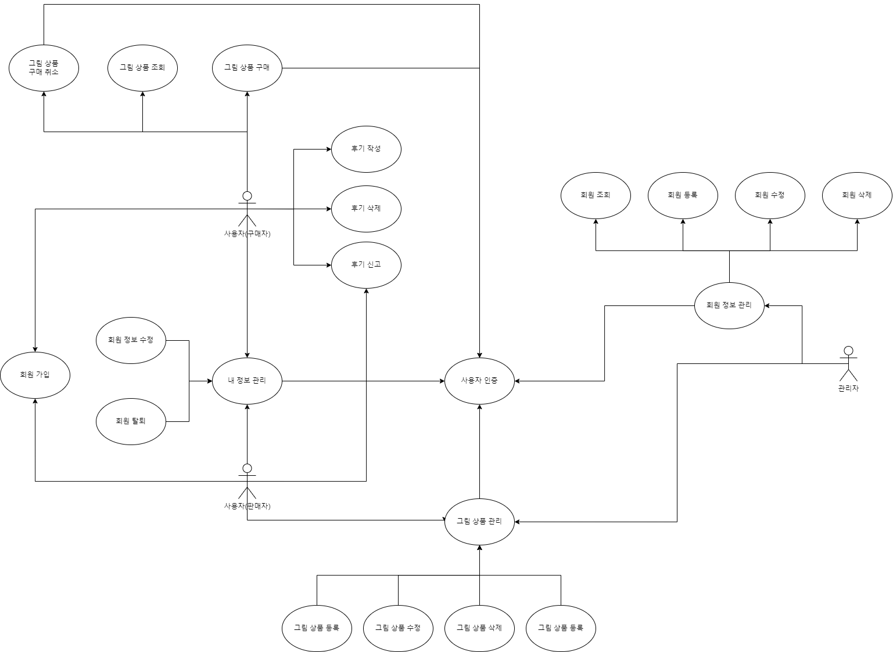
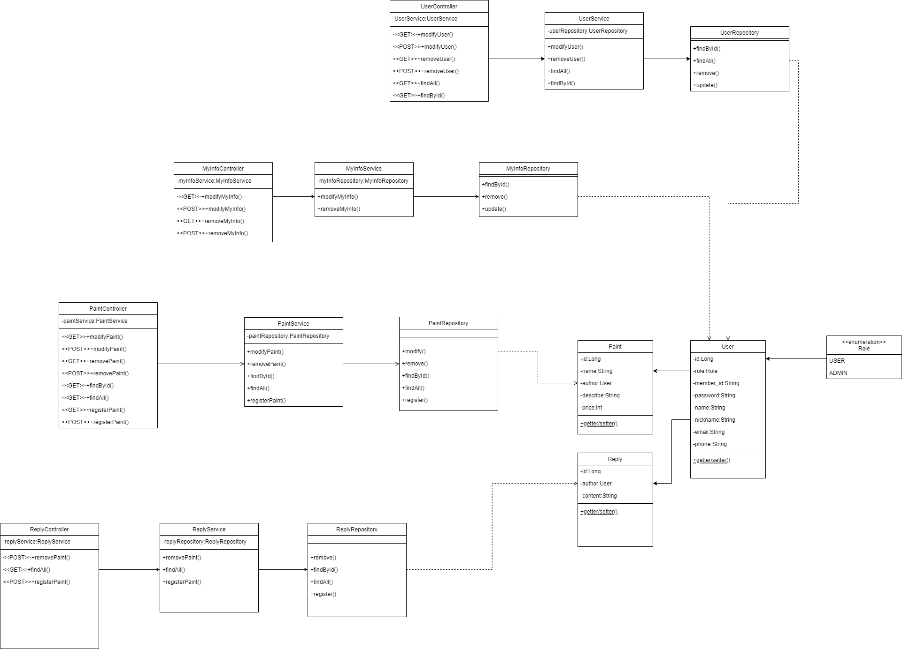

# 디지털 그림 쇼핑몰

# 프로젝트 설명
스프링 부트를 이용해 디지털 그림 쇼핑몰을 제작하는 프로젝트입니다

# 개발 환경
1. intelliJ 2023.2
2. java 11
3. springboot 2.7.17
4. gradle 8.3

# 요구사항
1. 디지털화된 그림을 판매할 수 있어야 함
2. 그림을 등록, 수정, 삭제, 조회가 가능해야 함
3. 등록시에는 항상 그림, 제목, 설명, 가격, 제작자가 들어가야 함
4. 그림에 추가적으로 태그를 넣어 태그로 검색을 할 수 있게 해야 함
5. 그림을 등록하기 위해서는 회원가입이 되어 있어야 함
6. 그림을 구매하기 위해선 회원이어야 함
7. 회원은 그림에 대한 댓글을 남길 수 있어야 함
8. 댓글도 작성, 조회, 삭제가 가능해야 함
9. 댓글은 구매자에 한에서만 작성이 가능해야 함
10. 댓글에는 신고 기능이 있어야 함
11. 회원 가입시에는 아이디, 비밀번호, 이름, 별명, 이메일, 전화번호를 입력해야 함
12. 회원의 별명과 이메일, 전화번호, 비밀번호는 수정이 가능해야 함
13. 수정을 할 때는 비밀번호를 한 번 더 확인하는 절차를 통해서만 수정 페이지로 이동이 가능함
14. 그림 검색은 제목, 제작자, 설명, 태그로 검색할 수 있어야 함

# 유스케이스 다이어그램

# 클래스 다이어그램
